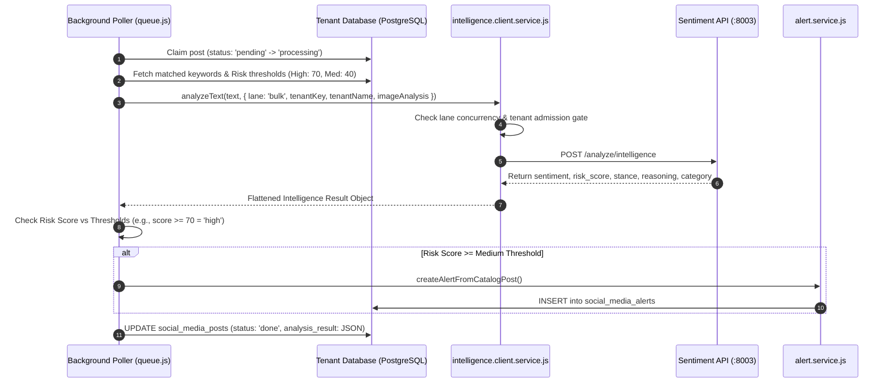
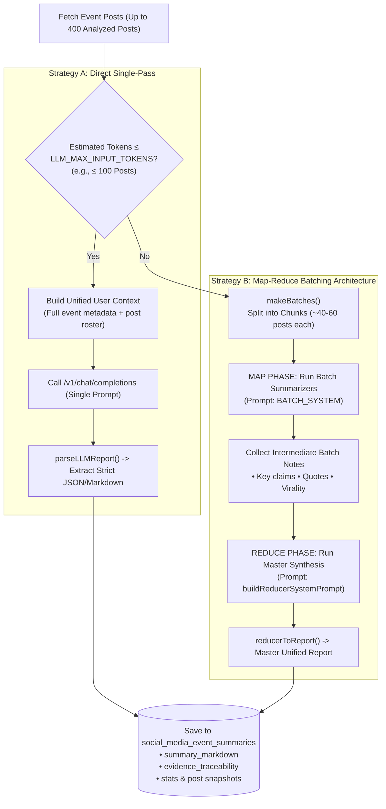
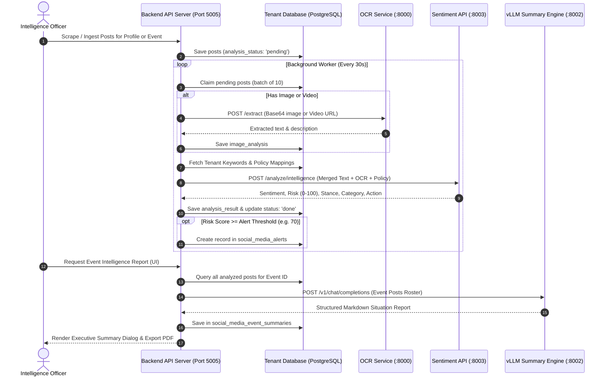

# Sockeye / Blurasaga AI Services Master Documentation
### Comprehensive Architecture, Logic, API Specifications & Integration Guide for OCR, Sentiment API, and LLM Services

---

## Table of Contents
1. [Executive Overview & Integrated Architecture](#1-executive-overview--integrated-architecture)
2. [Service 1: OCR & Video Analysis Service](#2-service-1-ocr--video-analysis-service)
   - [2.1 Purpose & Use Cases](#21-purpose--use-cases)
   - [2.2 Architecture & Underlying Engine](#22-architecture--underlying-engine)
   - [2.3 Client Implementation & Execution Logic](#23-client-implementation--execution-logic)
   - [2.4 API Endpoint Specifications & Payloads](#24-api-endpoint-specifications--payloads)
   - [2.5 Error Handling, Retries & Fallbacks](#25-error-handling-retries--fallbacks)
3. [Service 2: Custom Sentiment & Intelligence API](#3-service-2-custom-sentiment--intelligence-api)
   - [3.1 Purpose & Capabilities](#31-purpose--capabilities)
   - [3.2 Architecture & Multimodal Pipeline](#32-architecture--multimodal-pipeline)
   - [3.3 Concurrency Lanes & Tenant-Fair Admission Gate](#33-concurrency-lanes--tenant-fair-admission-gate)
   - [3.4 Policy Pack Sync & Dynamic Keyword Injection](#34-policy-pack-sync--dynamic-keyword-injection)
   - [3.5 Execution Logic & Alert Generation Flow](#35-execution-logic--alert-generation-flow)
   - [3.6 API Endpoint Specifications & Response Schema](#36-api-endpoint-specifications--response-schema)
4. [Service 3: Large Language Model (LLM) Service & Summarization](#4-service-3-large-language-model-llm-service--summarization)
   - [4.1 Purpose & Core Roles](#41-purpose--core-roles)
   - [4.2 Architecture & Infrastructure (vLLM / Ollama)](#42-architecture--infrastructure-vllm--ollama)
   - [4.3 Event Intelligence Summarizer (Single-Pass vs Map-Reduce)](#43-event-intelligence-summarizer-single-pass-vs-map-reduce)
   - [4.4 Auxiliary LLM Services: Event Terms & Hashtag Generator](#44-auxiliary-llm-services-event-terms--hashtag-generator)
   - [4.5 UTF-8 Sanitization & Post-Processing Logic](#45-utf-8-sanitization--post-processing-logic)
   - [4.6 API Endpoint Specifications & Prompt Structures](#46-api-endpoint-specifications--prompt-structures)
5. [Comparative Integration Matrix](#5-comparative-integration-matrix)
6. [Complete End-to-End Processing Workflow](#6-complete-end-to-end-processing-workflow)
7. [Environment Variables & Configuration Reference](#7-environment-variables--configuration-reference)
8. [Operational Runbook & Troubleshooting](#8-operational-runbook--troubleshooting)

---

## 1. Executive Overview & Integrated Architecture

The **Blurasaga / Sockeye** intelligence platform processes large volumes of unstructured multi-platform social media data (X/Twitter, Facebook, Instagram, YouTube, Telegram, Reddit, RSS) across multiple isolated tenant databases.

To transform raw posts into actionable intelligence and real-time security alerts, the system integrates three specialized AI services:

```mermaid
flowchart TD
    %% Base Styling
    classDef raw fill:#1e293b,stroke:#3b82f6,stroke-width:2px,color:#fff;
    classDef ocr fill:#065f46,stroke:#10b981,stroke-width:2px,color:#fff;
    classDef sentiment fill:#581c87,stroke:#a855f7,stroke-width:2px,color:#fff;
    classDef llm fill:#831843,stroke:#ec4899,stroke-width:2px,color:#fff;
    classDef db fill:#1e1b4b,stroke:#6366f1,stroke-width:2px,color:#fff;
    classDef alert fill:#7f1d1d,stroke:#ef4444,stroke-width:2px,color:#fff;

    RawPost["Raw Ingested Post / Event Media<br/>(Text, Images, Videos, Metadata)"]:::raw
    
    subgraph S1["1. Media Extraction: OCR & Video Service"]
        OcrDecision{"Contains Image<br/>or Video?"}
        OcrService["OCR & Video API (:8000)<br/>Qwen2.5-VL / IndicOCR<br/>• Full Text & Bounding Boxes<br/>• Video Scene Descriptions"]:::ocr
        NoMedia["Text-Only Post"]
    end

    subgraph S2["2. Intelligence & Policy Evaluation: Sentiment API"]
        Enrichment["Policy Mapping & Keyword Engine<br/>• Tenant Keywords Table<br/>• Legal Sections & Platform Rules<br/>• Tenant Policy Packs (SHA-256)"]
        SentimentAPI["Sentiment & Intelligence API (:8003)<br/>Deterministic Model + vLLM Gate<br/>• Sentiment & Confidence<br/>• Risk Score (0-100) & Stance<br/>• Category, Intent, Reasoning, Action"]:::sentiment
    end

    subgraph S3["3. Threat Classification & Alerts"]
        ThresholdCheck{"Risk Score &ge; High / Medium<br/>Threshold?"}
        AlertStore[("social_media_alerts<br/>(PostgreSQL)")]:::alert
        PostStore[("social_media_posts / event_media<br/>analysis_status = 'done'<br/>analysis_result = JSON")]:::db
    end

    subgraph S4["4. Synthesis & Reporting: LLM Service"]
        EventAgg["Event / Case Aggregation<br/>(Hundreds to Thousands of Posts)"]
        LLMService["vLLM / Ollama Engine (:8002)<br/>Qwen3-14B-AWQ (OpenAI Compatible)<br/>• Single-Pass Analysis (&le; 100 posts)<br/>• Map-Reduce Batching (> 100 posts)<br/>• Executive Markdown Reports & PDFs"]:::llm
        HashtagGen["Event Hashtag Generator (:2001)<br/>FastAPI / Deterministic Search"]:::llm
    end

    %% Pipeline Connections
    RawPost --> OcrDecision
    OcrDecision -- "Has Image / Video" --> OcrService
    OcrDecision -- "Text Only" --> NoMedia
    
    OcrService --> Enrichment
    NoMedia --> Enrichment
    Enrichment --> SentimentAPI
    
    SentimentAPI --> ThresholdCheck
    ThresholdCheck -- "Yes (High/Medium)" --> AlertStore
    ThresholdCheck --> PostStore
    AlertStore -.-> PostStore

    PostStore --> EventAgg
    EventAgg --> LLMService
    EventAgg -.-> HashtagGen
```



---

## 2. Service 1: OCR & Video Analysis Service

### 2.1 Purpose & Use Cases
A massive portion of intelligence signals on social media exists inside images and videos (e.g., protest banners, newspaper cutouts, meme text, official notices, on-screen video text, incident footage). Standard text scrapers miss this content completely.

The **OCR & Video Analysis Service** solves this by:
1. **High-Fidelity Text Extraction (Images)**: Reads English, Hindi, Odia, and other Indic scripts directly from uploaded or scraped images.
2. **Video Scene Understanding (Videos)**: Samples video frames across video clips, extracting visual scene descriptions, contextual summaries, and on-screen textual overlays.
3. **Preserving Raw Post Integrity**: Stores extracted text separately in `image_analysis` rather than appending directly into the raw post text, maintaining raw data fidelity for legal audits.

---

### 2.2 Architecture & Underlying Engine
- **Service Endpoint**: `http://101.53.140.97:8000` (Configured via `OCR_SERVICE_URL`).
- **Primary Vision-Language Model**: `Qwen/Qwen2.5-VL-7B-Instruct` served via vLLM on port `8001` (`http://101.53.140.97:8001`).
- **Fallback Engine**: Local `IndicOCR` multi-threaded worker pool for OCR extraction when GPU VLM is busy or degraded.
- **Hardware Acceleration**: Shared NVIDIA L40S 46 GB GPU (~27.8 GB dedicated to Qwen2.5-VL).

---

### 2.3 Client Implementation & Execution Logic
Implemented in [`backend/src/services/media_post_analysis/extractOcr.js`](file:///Users/bcss/Desktop/sockeye/backend/src/services/media_post_analysis/extractOcr.js) and consumed by [`analyzeMediaPost.js`](file:///Users/bcss/Desktop/sockeye/backend/src/services/media_post_analysis/analyzeMediaPost.js).

#### 1. Image Download with Anti-403 Referer Spoofing
CDN providers (Instagram, Facebook/Meta CDN, X/Twitter `twimg.com`, Telegram) block automated image scrapers with HTTP `403 Forbidden` if headers are missing. The client dynamically derives the proper `Referer` and `User-Agent`:

```javascript
function refererFor(url) {
  try {
    const { hostname } = new URL(url);
    if (/instagram\.com|cdninstagram\.com/i.test(hostname)) return 'https://www.instagram.com/';
    if (/fbcdn\.net|facebook\.com/i.test(hostname)) return 'https://www.facebook.com/';
    if (/twimg\.com|twitter\.com|x\.com/i.test(hostname)) return 'https://twitter.com/';
    if (/telegram\.org|t\.me/i.test(hostname)) return 'https://web.telegram.org/';
    return undefined;
  } catch (_) {
    return undefined;
  }
}
```

#### 2. Base64 Image Conversion
Images up to **25 MB** are downloaded into memory buffers and converted to Base64 strings:
```javascript
const resp = await axios.get(imageUrl, {
  responseType: 'arraybuffer',
  timeout: 30000,
  headers: { 'User-Agent': 'Mozilla/5.0 ...', ...(referer ? { Referer: referer } : {}) },
  maxContentLength: 25 * 1024 * 1024,
});
const base64Image = Buffer.from(resp.data).toString('base64');
```

#### 3. Video URL Extraction Strategy
Direct binary upload of large video files would exhaust network sockets. Therefore, for videos:
- The backend identifies direct video stream URLs (`.mp4`, `.mov`, `.webm`, `.m3u8`).
- The backend sends `{ video_url, tenant_key }` directly to the OCR service.
- The OCR service downloads the video server-side using SSRF-guarded fetchers, extracts sampled keyframes, and runs Qwen2.5-VL inference.

---

### 2.4 API Endpoint Specifications & Payloads

#### Endpoint 1: Health & Liveness
- **Method**: `GET /health`
- **Response**:
```json
{
  "status": "healthy",
  "active_engine": "qwen2.5-vl",
  "indic_fallback_pool": {
    "pool_size": 0,
    "workers_available": 0
  }
}
```

#### Endpoint 2: Extract Text / Video Descriptions
- **Method**: `POST /extract`
- **Headers**: `Content-Type: application/json`
- **Request Body Options**:

##### Option A: Image (Base64)
```json
{
  "image_base64": "/9j/4AAQSkZJRgABAQAAAQABAAD...",
  "tenant_key": "blurasaga_user_police_1",
  "min_confidence": 0.6
}
```

##### Option B: Video (Direct URL)
```json
{
  "video_url": "https://video.twimg.com/ext_tw_video/12345/pu/vid/720x1280/xyz.mp4",
  "tenant_key": "blurasaga_user_police_1"
}
```

#### Response Structure:
```json
{
  "success": true,
  "data": {
    "full_text": "PROTEST NOTICE: Gathering at Master Canteen Square on 10th Oct at 10:00 AM.",
    "bounding_boxes": [
      {
        "box": [120, 45, 600, 180],
        "text": "PROTEST NOTICE",
        "confidence": 0.98
      }
    ],
    "language": "en",
    "confidence": 0.96,
    "description": "A yellow protest poster calling for an assembly at Master Canteen.",
    "summary": "Public protest announcement poster.",
    "visible_text": ["PROTEST NOTICE", "Master Canteen", "10th Oct"]
  },
  "error": null
}
```

---

### 2.5 Error Handling, Retries & Fallbacks
- **Retry Mechanism**: Exponential backoff (`1s`, `2s`, `4s`... up to 8s).
- **Max Attempts**: Configurable via `OCR_MAX_ATTEMPTS` (Default: `3` for images, `2` for videos).
- **Non-retryable Errors**: HTTP `403 Forbidden` / `404 Not Found` on image download fail fast immediately to avoid stalling the processing queue.
- **Failures Saved Gracefully**:
```json
{
  "error": "Download failed: Request failed with status code 404",
  "failed": true,
  "attempts": 1,
  "media_type": "image"
}
```

---

## 3. Service 2: Custom Sentiment & Intelligence API

### 3.1 Purpose & Capabilities
Social media text often contains sarcasm, code-mixed Indic languages (Hinglish/Odia-English), subtle threats, or administrative grievances that simple keyword filters cannot accurately categorize.

The **Sentiment & Intelligence API** provides deep text understanding:
1. **Deterministic Sentiment Analysis**: High-speed, reproducible 3-class sentiment (`positive`, `neutral`, `negative`) with confidence scores.
2. **Stance Detection**: Determines whether the author **Supports**, **Opposes**, is **Neutral**, or **Unclear** towards a specified government body, leader, or event topic.
3. **Threat & Risk Scoring (0–100)**: Quantifies actionable risk based on violence incitement, communal disharmony, defamation, public order risks, or official complaints.
4. **Intent & Policy Categorization**: Maps posts to predefined legal and administrative violation categories (e.g., *Defamation*, *Hate Speech*, *Public Order*, *Administrative Grievance*).
5. **LLM Chain-of-Thought Reasoning & Action**: Provides human-readable reasoning and recommended police/administrative action.

---

### 3.2 Architecture & Multimodal Pipeline
- **Service Endpoint**: `http://127.0.0.1:8003/analyze/intelligence` (or `http://101.53.140.97:8003`).
- **Internal Pipeline**:
  - **Stage 1**: Language identification, translation/transliteration to English if needed.
  - **Stage 2**: Deterministic sentiment engine (Cardiff NLP roBERTa).
  - **Stage 3**: LLM inference gate for Category, Risk, Stance, and Reasoning.

---

### 3.3 Concurrency Lanes & Tenant-Fair Admission Gate
Implemented in [`backend/src/modules/intelligence/intelligence.client.service.js`](file:///Users/bcss/Desktop/sockeye/backend/src/modules/intelligence/intelligence.client.service.js).

To prevent background batch ingestion from starving interactive user UI requests (e.g., manual single-post analysis or live investigation), the client implements **Two Independent Lanes**:

| Metric / Setting | Bulk Lane (`bulk`) | Interactive Lane (`interactive`) |
| :--- | :--- | :--- |
| **Primary Use Case** | Scheduled background pollers, full dataset re-analysis | User clicking "Analyze Now", single post triage |
| **Target Concurrency** | Configurable via `INTELLIGENCE_BULK_CONCURRENCY` (Default: `1`) | Configurable via `INTELLIGENCE_INTERACTIVE_CONCURRENCY` (Default: `1`) |
| **Request Timeout** | `180,000 ms` (3 minutes) | `100,000 ms` (~1.6 minutes) |
| **Ready Queue Capacity** | `200` items | `50` items |
| **Max Waiters (FIFO)** | `5,000` items | `500` items |
| **Drop Behavior** | Zero data loss; parks in FIFO waiter pool until worker slot opens | Dedicated pool ensures instant response for UI users |

#### Tenant-Fair Scheduling (`tenant_key` & `tenant_name`):
- `tenant_key` (`dbName`): Ensures multiple tenants sharing the same backend do not starve each other in the admission queue.
- `tenant_name`: Passes the sanitized admin/tenant display name (e.g., *"Odisha Police Crime Branch"*) to ground stance detection.

---

### 3.4 Policy Pack Sync & Dynamic Keyword Injection
The client extracts active categories from the database via [`mappingService`](file:///Users/bcss/Desktop/sockeye/backend/src/modules/settings/mapping.service.js) and constructs a structured **Policy Pack** sent to the Sentiment API:

```javascript
function buildPolicyPack() {
  const categories = mappingService.mappingData.category_mappings.map(m => ({
    id: m.category_id,
    definition: m.definition.slice(0, 500),
    severity: m.severity_level,
    keywords: m.keywords.slice(0, 40)
  }));
  // Uses SHA-256 fingerprint caching to avoid redundant JSON overhead
  const fingerprint = `sha256:${crypto.createHash('sha256').update(JSON.stringify(categories)).digest('hex')}`;
  return { name: 'sockeye-policy-mapping', fingerprint, categories };
}
```

---

### 3.5 Execution Logic & Alert Generation Flow
Implemented in [`analyzePost.js`](file:///Users/bcss/Desktop/sockeye/backend/src/services/sentimentanalysis/analyzePost.js) and [`analyzeMediaPost.js`](file:///Users/bcss/Desktop/sockeye/backend/src/services/media_post_analysis/analyzeMediaPost.js).



---

### 3.6 API Endpoint Specifications & Response Schema

#### Endpoint: Intelligence Analysis
- **Method**: `POST /analyze/intelligence`
- **Headers**:
  - `Content-Type: application/json`
  - `x-api-key: <GATEWAY_API_KEY>`

#### Request Payload:
```json
{
  "texts": ["Heavy protest planned outside SP office tomorrow regarding electricity tariff hike."],
  "tenant_name": "State Police Intelligence Wing",
  "tenant_key": "blurasaga_sp_office_1",
  "policy_pack": {
    "name": "sockeye-policy-mapping",
    "fingerprint": "sha256:8f4c28...",
    "unknown_label": "Normal",
    "categories": [
      {
        "id": "Public Unrest",
        "definition": "Calls for mass agitations, road blockades, or vandalism",
        "severity": "High",
        "keywords": ["protest", "strike", "blockade", "gherao"]
      }
    ]
  },
  "image_analysis": {
    "full_text": "RALLY TOMORROW 10AM",
    "language": "en"
  },
  "intent_mode": "free",
  "timeout_s": 120
}
```

#### Response Structure:
```json
{
  "results": [
    {
      "sentiment": "negative",
      "confidence": 0.94,
      "language": "en",
      "english_text": null,
      "was_translated": false,
      "was_transliterated": false,
      "intelligence": {
        "risk_score": 75,
        "stance": "oppose",
        "stance_confidence": 0.89,
        "category": "Public Unrest",
        "intent": "Mobilizing public agitation against administration",
        "reasoning": "Post explicitly organizes a protest outside a key government installation (SP office) targeting public officials.",
        "summary": "Protest call against electricity tariff hike outside SP office.",
        "recommended_action": "Deploy preventative security personnel and monitor local organizers.",
        "signals": ["protest_organizing", "government_target"],
        "evidence_confidence": "high",
        "source": "provider",
        "model": "qwen3-14b-intelligence",
        "latency_ms": 1420
      }
    }
  ]
}
```

---

## 4. Service 3: Large Language Model (LLM) Service & Summarization

### 4.1 Purpose & Core Roles
While the Sentiment API operates at a single-post granularity, the **LLM Service** operates at the **Macro / Aggregate Level**. It synthesizes hundreds or thousands of posts collected during an event or incident into high-level analytical reports:

1. **Event Executive Summaries**: Generates comprehensive situation reports covering chronological timeline, grievance highlights, sentiment breakdown, key influencers, and threat levels.
2. **Automated PDF Situation Reports**: Formats narrative intelligence with citations of specific post IDs, author handles, and engagement numbers for high-ranking officials.
3. **Keyword & Hashtag Generator**: Generates relevant monitoring hashtags and boolean search terms from event title, location, and description.

---

### 4.2 Architecture & Infrastructure (vLLM / Ollama)
- **Primary Host**: `http://101.53.140.97:8002` (Configured via `LLM_BASE_URL` with `/v1/chat/completions`).
- **Model**: `Qwen/Qwen3-14B-AWQ` (OpenAI-compatible protocol).
- **Alternative / Local Engine**: Ollama running locally on port `11434` (`OLLAMA_BASE_URL=http://127.0.0.1:11434`).
- **Memory Footprint**: Fits within ~13.1 GB GPU VRAM on the NVIDIA L40S, with up to `4` concurrent sequences.

---

### 4.3 Event Intelligence Summarizer (Single-Pass vs Map-Reduce)
Implemented in [`backend/src/services/SummaryLLM/eventSummary.service.js`](file:///Users/bcss/Desktop/sockeye/backend/src/services/SummaryLLM/eventSummary.service.js) and [`eventSummary.prompt.js`](file:///Users/bcss/Desktop/sockeye/backend/src/services/SummaryLLM/eventSummary.prompt.js).

Depending on the number of posts associated with an event, the system automatically selects one of two processing strategies:



#### Token Safety & Budgeting:
- `LLM_CONTEXT_WINDOW`: Defaults to `16,384` tokens.
- `LLM_MAX_INPUT_TOKENS`: Defaults to `12,000` tokens.
- `LLM_SUMMARY_MAX_TOKENS`: Output ceiling bounded between `1,500` and `4,000` tokens (Default: `3,000`).

---

### 4.4 Auxiliary LLM Services: Event Terms & Hashtag Generator
Implemented in [`backend/src/services/eventHashtag/eventHashtag.client.js`](file:///Users/bcss/Desktop/sockeye/backend/src/services/eventHashtag/eventHashtag.client.js).

When an officer creates an event in the UI (e.g., *"Rath Yatra 2026 at Puri"*), the hashtag generator searches web and social corpus to recommend high-precision search keywords:
- **Upstream Service**: `http://127.0.0.1:2001` (Managed by PM2 as `event-hashtag-generator`).
- **Endpoint**: `POST /event-terms`
- **Payload**:
```json
{
  "event": "Farmers Protest Rally",
  "location": "Bhubaneswar, Odisha",
  "description": "Kisan Mahapanchayat demanding minimum support price revision.",
  "include_social": true,
  "max_hashtags": 10,
  "max_keywords": 15
}
```
- **Response**:
```json
{
  "hashtags": ["#KisanProtest", "#OdishaFarmers", "#BhubaneswarRally", "#MSPNow"],
  "keywords": ["kisan mahapanchayat", "farmer union", "PM Fasal Bima", "krushak morcha"]
}
```

---

### 4.5 UTF-8 Sanitization & Post-Processing Logic
LLM tokenizers and PostgreSQL JSONB columns crash on lone surrogate pairs, non-printable control characters, or unescaped null bytes. The service enforces strict pre- and post-sanitization:

```javascript
const cleanSafeUtf8 = (val, maxLen = 0) => {
  if (val === null || val === undefined) return '';
  let s = String(val);
  // Replaces unpaired surrogates with well-formed unicode
  if (typeof s.toWellFormed === 'function') {
    s = s.toWellFormed();
  } else {
    s = s.replace(/[\uD800-\uDBFF](?![\uDC00-\uDFFF])|(?<![\uD800-\uDBFF])[\uDC00-\uDFFF]/g, '');
  }
  // Strips null bytes and non-printable control characters
  s = s.replace(/[\x00-\x08\x0B\x0C\x0E-\x1F\x7F]/g, '');
  s = s.replace(/[\r\n\t]+/g, ' ').replace(/\s+/g, ' ').trim();
  return maxLen > 0 ? s.slice(0, maxLen) : s;
};
```

---

### 4.6 API Endpoint Specifications & Prompt Structures

#### Chat Completions Request Format (OpenAI Standard)
- **Endpoint**: `POST {LLM_BASE_URL}/chat/completions`
- **Payload**:
```json
{
  "model": "qwen3-14b",
  "temperature": 0.2,
  "max_tokens": 3000,
  "messages": [
    {
      "role": "system",
      "content": "You are a senior Law Enforcement & Intelligence Analyst. Produce an executive situation report adhering strictly to verified evidence..."
    },
    {
      "role": "user",
      "content": "EVENT CONTEXT: ...\nPOST ROSTER:\n[ID: 10492] @handle: Protest begins at 10 AM... (Likes: 450, Reposts: 120)"
    }
  ]
}
```

---

## 5. Comparative Integration Matrix

| Dimension | OCR & Video Service | Sentiment & Intelligence API | LLM Summarization Service |
| :--- | :--- | :--- | :--- |
| **Primary Base URL** | `http://101.53.140.97:8000` | `http://127.0.0.1:8003` / `http://101.53.140.97:8003` | `http://101.53.140.97:8002/v1` |
| **Primary Environment Variable** | `OCR_SERVICE_URL` | `CUSTOM_SENTIMENT_URL` / `INTELLIGENCE_SERVICE_URL` | `LLM_BASE_URL` |
| **Underlying Models** | `Qwen2.5-VL-7B-Instruct` + `IndicOCR` | Cardiff roBERTa + vLLM Qwen Gate | `Qwen3-14B-AWQ` (vLLM / Ollama) |
| **Calling Module** | `media_post_analysis/extractOcr.js` | `modules/intelligence/intelligence.client.service.js` | `services/SummaryLLM/eventSummary.service.js` |
| **Primary Input** | Image Base64 / Direct Video URL | Cleaned Post Text + OCR Text + Policy Pack + Keywords | Hundreds of aggregated posts + Event metadata |
| **Primary Output** | Extracted Text, Bounding Boxes, Video Summary | Sentiment, Risk Score (0-100), Stance, Category, Reasoning | Executive Markdown Narrative, Timeline, PDF Report |
| **Target Database Columns** | `social_media_posts.image_analysis` | `social_media_posts.analysis_result` | `social_media_event_summaries.summary_markdown` |
| **Retry Strategy** | Exponential backoff (1s, 2s, 4s...) up to 3 tries | Exponential backoff up to 5 tries; FIFO waiter pool on 429 | Map-Reduce sub-batch retry on timeout/failure |
| **Failure Behavior** | Marks `image_analysis.failed = true`, pipeline continues | Re-queues up to `MAX_ATTEMPTS`; marks `failed` if exhausted | Fallback to deterministic statistical summary |

---

## 6. Complete End-to-End Processing Workflow



---

## 7. Environment Variables & Configuration Reference

Add or verify these environment variables in `backend/.env`:

```env
# ==============================================================================
# AI & MACHINE LEARNING SERVICES CONFIGURATION
# ==============================================================================

# 1. OCR & Video Analysis Service (saga GPU box)
OCR_SERVICE_URL=http://101.53.140.97:8000
OCR_MAX_ATTEMPTS=3
OCR_VIDEO_MAX_ATTEMPTS=2
OCR_VIDEO_TIMEOUT_MS=600000

# 2. Custom Sentiment & Intelligence API
CUSTOM_SENTIMENT_URL=http://127.0.0.1:8003
INTELLIGENCE_SERVICE_URL=http://127.0.0.1:8003
SENTIMENT_MAX_ATTEMPTS=5
INTELLIGENCE_BULK_CONCURRENCY=1
INTELLIGENCE_INTERACTIVE_CONCURRENCY=1
INTELLIGENCE_TIMEOUT_MS=180000
INTELLIGENCE_INTENT_MODE=free

# 3. LLM Service (vLLM / Ollama for Event Summaries & Reports)
LLM_BASE_URL=http://101.53.140.97:8002/v1
LLM_API_KEY=ollama
LLM_MODEL=qwen3-14b
LLM_TIMEOUT_MS=180000
LLM_SUMMARY_MAX_TOKENS=3000
LLM_CONTEXT_WINDOW=16384
LLM_MAX_INPUT_TOKENS=12000
LLM_BATCH_CONCURRENCY=1

# 4. Event Keyword & Hashtag Generator (PM2 Local Process)
EVENT_HASHTAG_GENERATOR_URL=http://127.0.0.1:2001
EVENT_HASHTAG_GENERATOR_TIMEOUT_MS=120000
```

---

## 8. Operational Runbook & Troubleshooting

### Scenario 1: OCR Service is Timing Out or Failing
1. Check OCR service health:
   ```bash
   curl -s http://101.53.140.97:8000/health | jq
   ```
2. Check underlying Qwen2.5-VL container on port 8001:
   ```bash
   curl -s http://101.53.140.97:8001/health
   ```
3. If images fail with HTTP 403, verify if the domain is missing in `refererFor()` in [`extractOcr.js`](file:///Users/bcss/Desktop/sockeye/backend/src/services/media_post_analysis/extractOcr.js).

### Scenario 2: Sentiment API Returning 429 Backpressure
- The client automatically catches HTTP `429` responses and pauses subsequent requests according to the `Retry-After` header.
- Posts remain in `pending` status in PostgreSQL and are safely picked up during the next polling tick without data loss.

### Scenario 3: LLM Context Length Exceeded on Large Events
- The event summarizer uses `makeBatches()` to slice posts into chunks of 40–60 items.
- If individual batch prompts exceed token limits, reduce `LLM_MAX_ANALYSED_POSTS` in `.env` (default is `400`).

---

### Document Information
- **Applies to**: Sockeye / Blurasaga Intelligence Platform
- **Primary Source Code References**:
  - OCR: [`backend/src/services/media_post_analysis/extractOcr.js`](file:///Users/bcss/Desktop/sockeye/backend/src/services/media_post_analysis/extractOcr.js)
  - Sentiment: [`backend/src/modules/intelligence/intelligence.client.service.js`](file:///Users/bcss/Desktop/sockeye/backend/src/modules/intelligence/intelligence.client.service.js)
  - LLM: [`backend/src/services/SummaryLLM/eventSummary.service.js`](file:///Users/bcss/Desktop/sockeye/backend/src/services/SummaryLLM/eventSummary.service.js)
  - Hashtags: [`backend/src/services/eventHashtag/eventHashtag.client.js`](file:///Users/bcss/Desktop/sockeye/backend/src/services/eventHashtag/eventHashtag.client.js)
